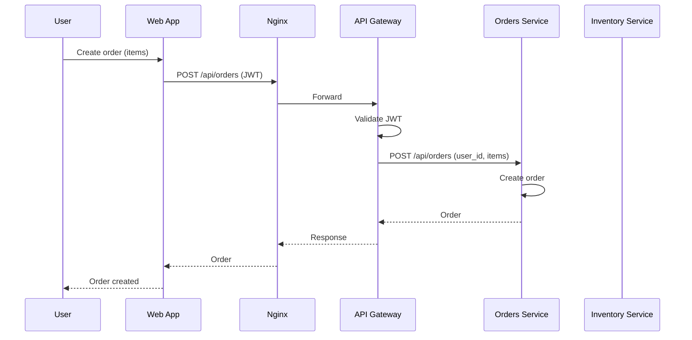
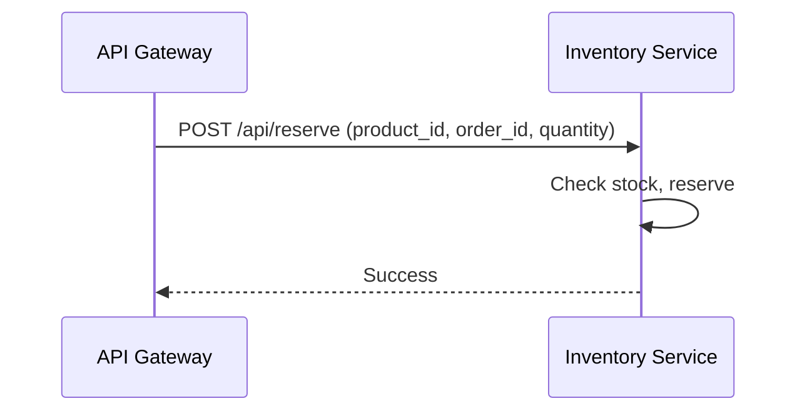

# UML Sequence Diagram - Place Order

## Place Order flow

```mermaid
sequenceDiagram
  participant User
  participant WebApp as Web App
  participant Nginx
  participant Gateway as API Gateway
  participant Orders as Orders Service
  participant Inventory as Inventory Service

  User->>WebApp: Create order (items)
  WebApp->>Nginx: POST /api/orders (JWT)
  Nginx->>Gateway: Forward
  Gateway->>Gateway: Validate JWT
  Gateway->>Orders: POST /api/orders (user_id, items)
  Orders->>Orders: Create order
  Orders-->>Gateway: Order
  Gateway-->>Nginx: Response
  Nginx-->>WebApp: Order
  WebApp-->>User: Order created
```

Optional reserve step (before or after order creation):

```mermaid
sequenceDiagram
  participant Gateway as API Gateway
  participant Inventory as Inventory Service

  Gateway->>Inventory: POST /api/reserve (product_id, order_id, quantity)
  Inventory->>Inventory: Check stock, reserve
  Inventory-->>Gateway: Success
```
